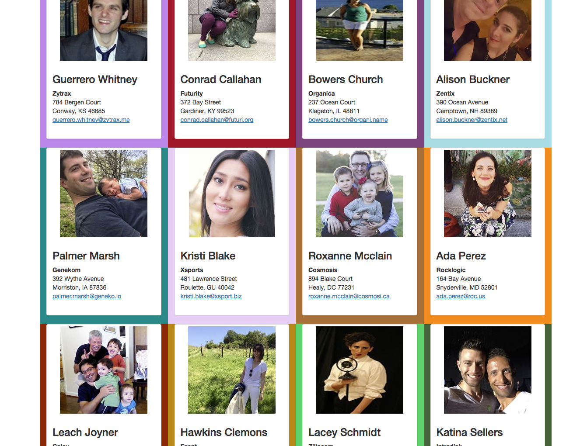

# jQuery Assignment #2

This assignment will be covering jQuery's [`$.ajax`][$.ajax], [`find`][jQuery find], [`attr`][jQuery attr], [`text`][jQuery text], and [`css`][jQuery css] function.

## Assignment

1. [Fork this repo][fork].

1. Only code inside the file named [script.js]. No editing any other files.

1. Using the [$.ajax] function, get the following url: `https://quarkbackend.com/getfile/karbassi/user-profiles`

1. Using the [$.ajax] `success` function, loop through the response. Do not use a [hard coded][hard coding] number in the loop.

1. Create a new function that updates one user at a time. Call this new function inside the loop in step 4.

1. This new function should update the elements of the div with the class of `user-profile`. It should:

    - Set the user's image.

    - Set the user's first and last name.

    - Set the user's company name and address.

    - Set the user's email address. The email address should be clickable.

    - Set the background color of `.user-profile` to the user's favorite color.

**Hint**: Email address links need to have `mailto:` in from of them. E.g: `<a href="mailto:person@example.com">person@example.com</a>`

### The HTML page should produce an image like so:

[fork]: https://github.com/karbassi-id/jQuery-assignment-2/fork
[script.js]: ./script.js
[$.ajax]: https://api.jquery.com/jQuery.ajax/
[jQuery find]: https://www.w3schools.com/jquery/traversing_find.asp
[jQuery attr]: https://www.w3schools.com/jquery/html_attr.asp
[jQuery text]: https://www.w3schools.com/jquery/html_text.asp
[jQuery css]: https://www.w3schools.com/jquery/jquery_css.asp
[hard coding]: https://encrypted.google.com/search?q=hard+coding

